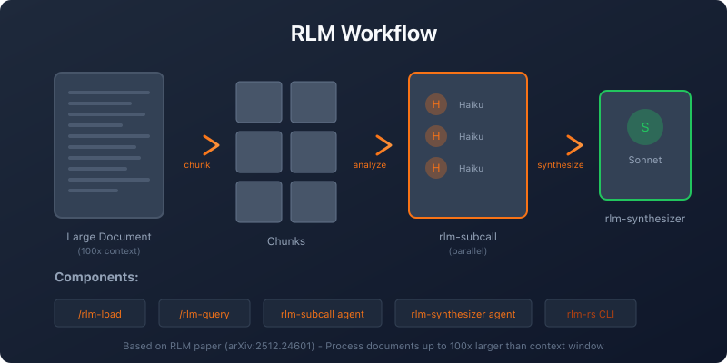

# RLM-RS Plugin for Claude Code

[](https://opensource.org/licenses/MIT)
[](https://github.com/anthropics/claude-code)
[](https://github.com/zircote/rlm)
[](https://arxiv.org/abs/2512.24601)

A Claude Code plugin that integrates the **rlm-rs** Rust CLI for processing documents that exceed typical context window limits using the Recursive Language Model (RLM) pattern.

<p align="center">
  
</p>

## Overview

This plugin enables Claude Code to:
- Process documents up to 100x larger than the context window
- Use multiple chunking strategies (fixed, semantic, parallel)
- **Hybrid semantic + BM25 search** to find relevant chunks efficiently
- Pass-by-reference chunk retrieval (no file I/O overhead)
- Delegate chunk-level analysis to efficient sub-LLM calls
- Synthesize coherent answers from distributed chunk analyses

## Prerequisites

**rlm-rs CLI** must be installed:

```bash
# Via Cargo (recommended)
cargo install --git https://github.com/zircote/rlm rlm-rs

# Via Homebrew
brew install zircote/tap/rlm-rs
```

## Installation

### From Marketplace

```bash
# Add the zircote marketplace (if not already added)
claude plugin marketplace add zircote https://github.com/zircote/marketplace

# Install the plugin
claude plugin install rlm-rs@zircote
```

### From GitHub

```bash
claude plugin install zircote/rlm-rs-plugin
```

### For Development

```bash
# Use --plugin-dir flag for local development
claude --plugin-dir /path/to/rlm-rs-plugin
```

### Verify Installation

Run `/help` in Claude Code - you should see `rlm-rs:rlm-init`, `rlm-rs:rlm-load`, etc.

## Components

### Skills

- **rlm**: Main RLM workflow orchestration for large context processing
- **rlm-chunking**: Guidance on selecting chunking strategies

### Commands

| Command | Description |
|---------|-------------|
| `/rlm-init` | Initialize the RLM database |
| `/rlm-load` | Load a file into a buffer with chunking |
| `/rlm-status` | Show current buffers and state |
| `/rlm-query` | Run a query against loaded content |

### Agents

- **rlm-subcall**: Haiku-based agent for efficient chunk analysis (uses pass-by-reference with chunk IDs)
- **rlm-synthesizer**: Sonnet-based agent for aggregating JSON findings into coherent responses

## Usage

### Basic Workflow

1. Initialize the database:
   ```
   /rlm-init
   ```

2. Load a large file:
   ```
   /rlm-load file=path/to/large-document.txt chunker=semantic
   ```

3. Query the content (uses hybrid semantic + BM25 search):
   ```
   /rlm-query query="What are the main themes discussed?"
   ```

The query command automatically:
- Searches for relevant chunks using hybrid search
- Generates embeddings on first search (cached for future queries)
- Analyzes only the most relevant chunks
- Synthesizes a coherent answer

### Using the RLM Skill

For automated orchestration, trigger the RLM skill by asking:
- "Process this large file using RLM"
- "Analyze document.txt which exceeds context"
- "Use recursive language model to examine logs.txt"

## Configuration

Create `.claude/rlm-rs.local.md` in your project for custom settings:

```yaml
---
chunk_size: 200000
overlap: 0
default_chunker: semantic
---
```

## Architecture

Based on the [RLM paper (arXiv:2512.24601)](https://arxiv.org/abs/2512.24601):

| RLM Concept | Implementation |
|-------------|----------------|
| Root LLM | Main Claude Code conversation (Opus/Sonnet) |
| Sub-LLM | `rlm-subcall` agent (Haiku) |
| External Environment | `rlm-rs` CLI with SQLite storage |

## Contributing

See [CONTRIBUTING.md](CONTRIBUTING.md) for development setup and guidelines.

## License

MIT
